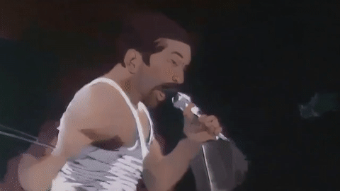

# Example Outputs

## Noise 0.63

Note: Higher noise is needed with this model to achieve the artistic look, but that creates more randomness in the outputs.

    

            
    

## Noise 0.30

Note: Used prompt from Painting Animation in Conjunction with this model

    

            
            
            
    

