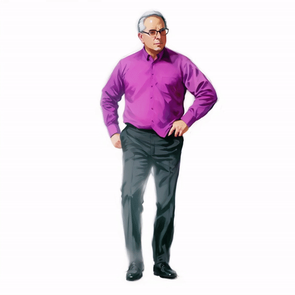

# Example Outputs

    

            
            
            
            
            
            
            
            
            
            
            
            
            
            
            
    

